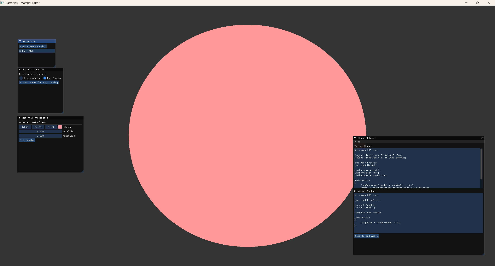

# CarrotToy

A material editor lab implementation inspired by Unreal and Unity, featuring runtime shader editing capabilities. Built with Xmake, supporting both real-time rasterization and offline ray tracing.

## Features

- **Modular Architecture**: Clean separation into Platform, Input, Core, RHI, Renderer, Launch, and Editor modules
- **Platform Abstraction**: Cross-platform window and event management (Windows, Linux, macOS)
- **Input System**: Dedicated input module for mouse and keyboard handling
- **Material System**: Create and manage materials with customizable shader parameters
- **Runtime Shader Editing**: Edit and recompile shaders in real-time without restarting the application
- **Real-time Rasterization**: OpenGL-based forward rendering with PBR (Physically Based Rendering) shaders
- **Offline Ray Tracing**: CPU-based ray tracing for high-quality offline rendering
- **Material Editor UI**: ImGui-based interface for intuitive material editing
- **Hot Reload**: Automatic shader reloading when files are modified
- **PBR Materials**: Built-in physically-based rendering shader support
- **RHI (Render Hardware Interface)**: Graphics API abstraction layer supporting multiple backends
- **Multiple Applications**: DefaultGame, TestRHIApp, CustomModule, and RenderBackendSandbox as independent executables
- **RenderBackendSandbox**: Isolated testing environment for DX12 and Vulkan API experimentation

## Architecture

The project is organized into modular components with clean separation of concerns:

```
CarrotToy/
├── src/
│   ├── Runtime/                 # Runtime engine modules
│   │   ├── Platform/            # Platform abstraction (window, events)
│   │   ├── Input/               # Input handling (mouse, keyboard)
│   │   ├── Core/                # Core engine functionality
│   │   ├── RHI/                 # Render Hardware Interface (separate module)
│   │   ├── Renderer/            # High-level rendering system
│   │   └── Launch/              # Application launcher
│   ├── Editor/                  # Material editor UI
│   ├── DefaultGame/             # Default game application (binary)
│   ├── TestRHIApp/              # RHI testing application (binary)
│   ├── CustomModule/            # Custom module example (binary)
│   └── RenderBackendSandbox/    # DX12/Vulkan sandbox (binary) - NEW
├── shaders/                     # GLSL/HLSL shader files
├── docs/                        # Documentation
└── xmake.lua                   # Build configuration
```

### Module Structure

The engine follows a layered architecture with well-defined module boundaries:

- **Platform**: OS and window abstraction layer (GLFW-based, cross-platform)
- **Input**: Input device abstraction (mouse, keyboard, future: gamepad)
- **Core**: Core engine systems (materials, shaders, utilities, module system)
- **RHI**: Graphics API abstraction layer (OpenGL, future: Vulkan, DX12, Metal)
- **Renderer**: High-level rendering system with material preview and scene rendering
- **Launch**: Application entry point and main loop with fixed timestep
- **Editor**: ImGui-based material editor
- **Applications**: DefaultGame, TestRHIApp, CustomModule, RenderBackendSandbox executables
- **RenderBackendSandbox**: Testing environment for DX12 and Vulkan API implementations

Each module is built as a separate library (shared or static), enabling modular development and testing.

For detailed architecture documentation, see [MODULE_ARCHITECTURE.md](docs/MODULE_ARCHITECTURE.md).

## Requirements

- C++17 compatible compiler
- Xmake build system
- OpenGL 3.3+
- GLFW
- GLAD
- GLM
- ImGui
- STB (for image loading/saving)

## Building

### Install Xmake

Follow the [Xmake installation guide](https://xmake.io/#/guide/installation).

### Build the project

```bash
# Configure and build all targets
xmake

# Run the default game application
xmake run DefaultGame

# Run the RHI test application
xmake run TestRHIApp

# Run the custom module example
xmake run CustomModule

# Run the render backend sandbox
xmake run RenderBackendSandbox

# Build specific targets
xmake build Platform              # Platform module
xmake build Input                 # Input module
xmake build Core                  # Core module
xmake build RHI                   # RHI module
xmake build Renderer              # Renderer module
xmake build Launch                # Launch module
xmake build Editor                # Editor module
xmake build DefaultGame           # Default game application
xmake build TestRHIApp            # RHI test application
xmake build CustomModule          # Custom module application
xmake build RenderBackendSandbox  # Render backend sandbox (NEW)
```

### Build options

```bash
# Build in debug mode
xmake f -m debug
xmake

# Build in release mode
xmake f -m release
xmake

# Build with static libraries (default is shared)
xmake f --module_kind=static
xmake

# Build with shared libraries (default)
xmake f --module_kind=shared
xmake

# Clean build
xmake clean
```

**Note:** By default, modules are built as **shared libraries** for faster iteration. Use `--module_kind=static` to build static libraries instead.

### Editor Configure

```bash
# Generate compile commands
xmake project -k compile_commands

# vscode setting
"C_Cpp.default.compileCommands": [
    "${workspaceFolder}/.vscode/compile_commands.json"
]
```

## Usage

### Material Editor Interface

The application provides several UI panels:

1. **Materials Panel**: List all materials, create new materials
2. **Material Properties**: Edit shader parameters (albedo, metallic, roughness, etc.)
3. **Shader Editor**: Edit vertex and fragment shaders in real-time
4. **Material Preview**: Preview the material on a 3D sphere with rotation

### Creating a Material

1. Click "Create New Material" in the Materials panel
2. Enter a name for your material
3. Select or create a shader
4. Adjust material parameters in the Properties panel

### Editing Shaders

1. Select a material from the Materials panel
2. Click "Edit Shader" in Material Properties
3. Modify the vertex or fragment shader code
4. Click "Compile and Apply" to see changes immediately

### Render Modes

- **Rasterization**: Real-time OpenGL rendering (default)
- **Ray Tracing**: Offline CPU-based ray tracing for high-quality output

### Example Material Parameters

**PBR Material:**
- `albedo` (vec3): Base color of the material
- `metallic` (float): Metallic property (0.0 = dielectric, 1.0 = metal)
- `roughness` (float): Surface roughness (0.0 = smooth, 1.0 = rough)

## Shader System

### Default PBR Shader

The default shader implements a physically-based rendering model with:
- Cook-Torrance BRDF
- GGX distribution
- Schlick-Beckmann geometry function
- Fresnel-Schlick approximation

### Custom Shaders

Create custom shaders by:
1. Adding `.vert` and `.frag` files to the `shaders/` directory
2. Loading them through the Material Editor
3. Defining custom uniforms and material parameters

### Shader Hot-Reloading

Shaders can be reloaded at runtime:
- Through the Shader Editor UI
- By calling `shader->reload()` programmatically
- Changes take effect immediately without application restart

## Ray Tracing

The offline ray tracer supports:
- Basic geometry (spheres, meshes)
- Simple lighting calculations
- Scene export from rasterization view
- PNG output format

To perform offline ray tracing:
1. Set up your scene in rasterization mode
2. Click "Export Scene for Ray Tracing"
3. Use the RayTracer API to render the scene

## Extending CarrotToy

### Adding New Material Parameters

```cpp
material->setFloat("myParameter", 1.0f);
material->setVec3("myColor", 1.0f, 0.0f, 0.0f);
```

### Creating Custom Materials

```cpp
auto shader = std::make_shared<Shader>("path/to/vertex.vert", "path/to/fragment.frag");
auto material = MaterialManager::getInstance().createMaterial("MyMaterial", shader);
```

### Implementing New Render Features

Extend the `Renderer` class to add:
- Deferred rendering
- Post-processing effects
- Advanced lighting systems
- Shadow mapping

## Documentation

- **[Quick Start Guide](QUICKSTART.md)** - Get started in 1 minute
- **[Build Instructions](BUILD.md)** - Detailed build guide
- **[Tutorial](TUTORIAL.md)** - Step-by-step learning path
- **[Examples](EXAMPLES.md)** - Code examples and snippets
- **[Architecture](ARCHITECTURE.md)** - System design documentation
- **[Contributing](CONTRIBUTING.md)** - How to contribute
- **[Changelog](CHANGELOG.md)** - Version history

## Project Status

**Version**: 0.1.0 (Initial Release)

### Implemented Features
✅ Real-time rasterization with OpenGL  
✅ Material system with parameter management  
✅ Runtime shader editing and hot-reloading  
✅ ImGui-based material editor interface  
✅ PBR shader implementation  
✅ CPU-based ray tracing  
✅ Material preview with 3D sphere  
✅ Xmake and CMake build support  
✅ **RHI (Render Hardware Interface) abstraction layer**  

### Planned Features
🔄 Texture support for materials  
🔄 Multiple geometry types  
🔄 Material save/load system  
🔄 Node-based shader editor  
🔄 Real-time ray tracing (GPU)  
🔄 Post-processing effects  
🔄 Vulkan/DirectX/Metal backend support (via RHI)  

See [CHANGELOG.md](CHANGELOG.md) for detailed roadmap.

## Community

- **Issues**: Report bugs or request features on GitHub Issues
- **Discussions**: Ask questions and share ideas
- **Pull Requests**: Contribute code improvements

## License

This project is licensed under the MIT License - see the [LICENSE](LICENSE) file for details.

## Acknowledgments

- Inspired by Unreal Engine and Unity material editors
- Built with Xmake build system
- Uses ImGui for the editor interface
- PBR implementation based on LearnOpenGL tutorials
- Ray tracing concepts from "Ray Tracing in One Weekend"

## Contributors

Thanks to all contributors who help make CarrotToy better!

See [CONTRIBUTING.md](CONTRIBUTING.md) to learn how you can contribute.