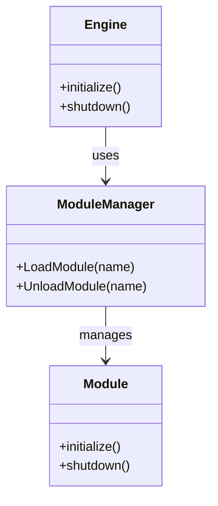

# Module
- [x] 拆分Module - Editor (Completed: MaterialEditor moved to Editor module, GameModule concept removed)

# RHI
- [ ] 重构RHI
- [ ] 解耦Device
- [ ] 解耦Window
- [ ] OpenglRHI修复bug
- [ ] 接入NVRHI
- [ ] 支持vulkan
- [ ] 支持dx12

# MISC
- [ ] 清理代码中残留的gl和glfw

# Structure
